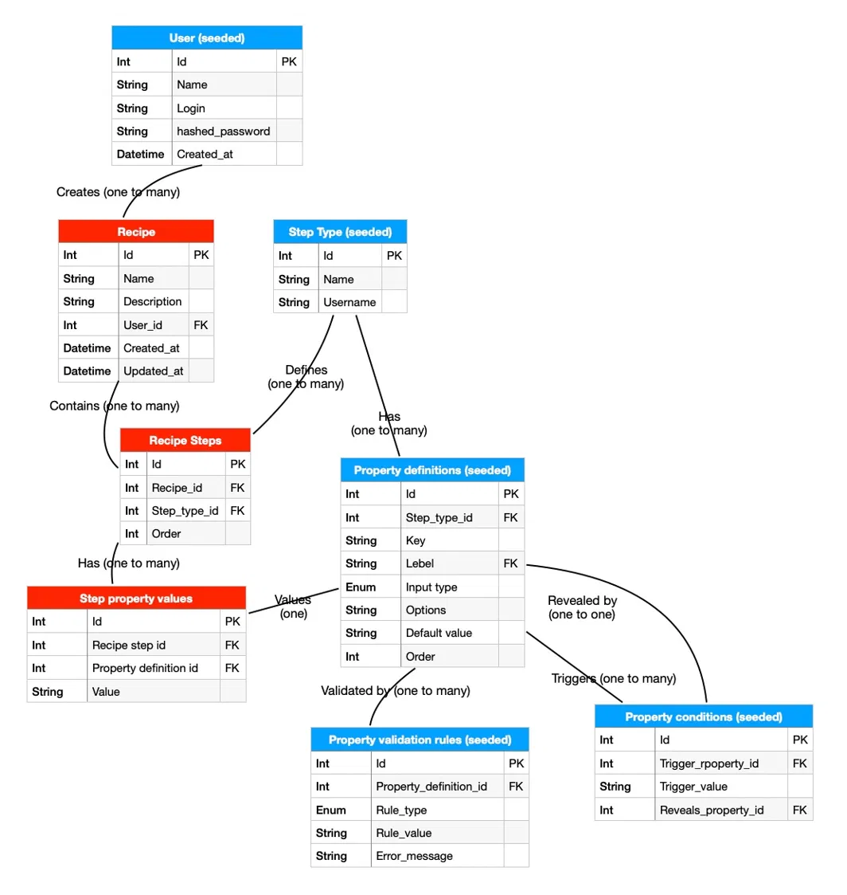

# Recipe Creation App

A full-stack application for creating and managing robotic arm automation recipes. Built with React + TypeScript, FastAPI, and PostgreSQL.

---

## Setup

The entire stack runs via Docker Compose. No local Python or Node setup required.

**Prerequisites:** Docker Desktop or [Colima](https://github.com/abiosoft/colima) (my case)

```bash
# If using Colima
brew install colima docker docker-compose
colima start --cpu 2 --memory 4 --disk 20
```

**Run the app:**

```bash
git clone <repo-url>
cd recipe-app
docker compose up --build
```

On first boot the backend automatically runs Alembic migrations and seeds the database — no manual steps needed.

| Service | URL |
|---|---|
| Frontend | http://localhost:5173 |
| Backend API | http://localhost:8000 |
| API docs (Swagger) | http://localhost:8000/docs |

**Demo credentials:** `user1` / `password` or `user2` / `password`

**Stop the app:**

```bash
docker compose down        # preserves data
docker compose down -v     # wipes database volume
```

---

## App Structure

```
recipe-app/
├── .github/workflows/ci.yml   # CI pipeline (lint + build on every push)
├── docker-compose.yml
├── backend/                   # FastAPI · SQLAlchemy · Alembic · PostgreSQL
│   └── app/
│       ├── api/               # Routers + shared dependencies
│       ├── models/            # SQLAlchemy models (one file per entity)
│       ├── schemas/           # Pydantic request/response schemas
│       ├── services/          # Business logic
│       └── db/                # Session, seed data
└── frontend/                  # React · TypeScript · Vite · Tailwind CSS
    └── src/
        ├── components/        # Reusable UI components
        ├── context/           # Auth state (AuthProvider, useAuth)
        ├── pages/             # Top-level views
        ├── services/          # Axios API client
        ├── types/             # Shared TypeScript interfaces
        └── utils/             # Validation, JSON import/export helpers
```

---

## Database



Most entities are **seeded at startup** rather than created by users. `step_types`, `property_definitions`, `property_conditions`, and `property_validation_rules` define the system's behaviour — the available step types, what properties they expose, which properties are conditionally revealed, and what validation rules apply to each.

This means the UI, backend validation, and JSON export/import logic are all **data-driven**. Adding a new step type requires only a seed change, not a code change.

User-created data (`recipes`, `recipe_steps`, `step_property_values`) builds on top of this seeded structure at runtime.

---

## Manual Testing

Three sample JSON files are provided in `for_manual_testing/` for testing the import flow:

| File | Purpose |
|---|---|
| `Valid.json` | Imports successfully — 4 steps across both step types |
| `Invalid.json` | Fails validation — negative coordinate value |
| `Empty.json` | Fails validation — steps array is empty |

Import via the **Import JSON** button on the dashboard, or the **From JSON** button in the recipe editor (create mode).